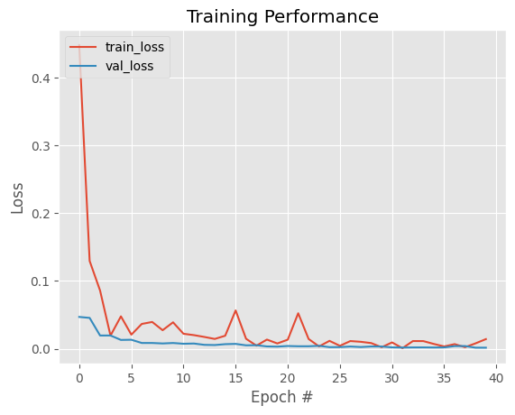
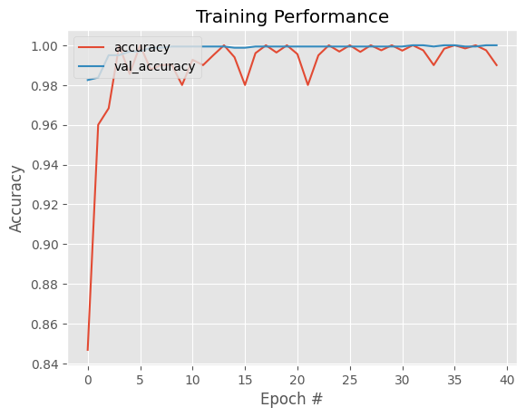
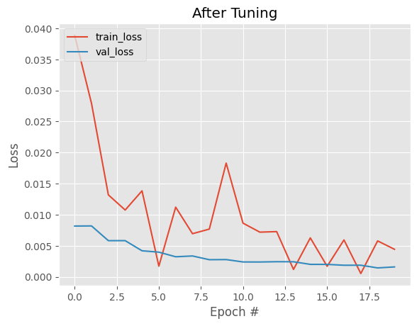
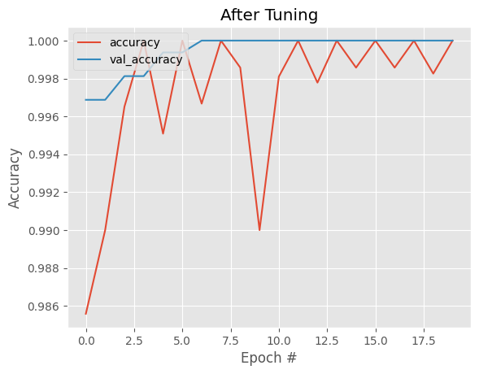

# People Detector

Este projeto implementa um detector de pessoas utilizando **TensorFlow/Keras**, com treinamento e quantização do modelo para uso em dispositivos embarcados.

## 📂 Estrutura do Projeto
```
people-detector/
│── human-and-non-human/        # Dataset utilizado no treinamento
│   ├── training_set/           # Conjunto de treinamento
│   │   ├── NENHUM/             # Imagens sem pessoas
│   │   ├── PESSOA/             # Imagens com pessoas
│   ├── test_set/               # Conjunto de teste
│
│── models/                     # Modelos treinados e quantizados
│   ├── home-people-train-model.h5       # Modelo treinado em Keras
│   ├── home-people-train-model.tflite   # Modelo quantizado para TFLite
│
│── home-people-train.ipynb      # Jupyter Notebook do treinamento
│── home-people-quantization-test.ipynb  # Jupyter Notebook da quantização e testes
│
│── output1.png                  # Resultado do modelo Keras (.h5)
│── output2.png                  # Resultado do modelo Keras (.h5)
│── output3.png                  # Resultado do modelo quantizado (.tflite)
│── output4.png                  # Resultado do modelo quantizado (.tflite)
│
│── README.md                    # Documentação do projeto
│── requirements.txt              # Dependências do projeto
```

## 📖 Descrição

O modelo foi treinado para diferenciar imagens com pessoas e sem pessoas. Para isso, utilizamos um **dataset do Kaggle**, dividido em **training_set/** e **test_set/**.

O treinamento foi realizado em um modelo Keras salvo no formato **.h5** (1475 KB), posteriormente quantizado para **TFLite** (154 KB), permitindo sua execução eficiente em dispositivos embarcados.

## 🔧 Dependências
Instale as dependências antes de executar os notebooks:
```bash
pip install -r requirements.txt
```

## 🚀 Treinamento do Modelo
Execute o notebook `home-people-train.ipynb` para treinar o modelo:
```bash
jupyter notebook home-people-train.ipynb
```
Isso irá treinar a rede neural e salvar o modelo em `models/home-people-train-model.h5`.

## 🎯 Quantização e Conversão para TensorFlow Lite
O modelo treinado foi convertido para **TFLite** com quantização para **int8**. Para realizar a quantização, execute:
```bash
jupyter notebook home-people-quantization-test.ipynb
```
O modelo convertido será salvo como `models/home-people-train-model.tflite`.

## 📊 Resultados
Os resultados da inferência são apresentados nas imagens:
### **Modelo Keras (.h5):**



### **Modelo TFLite Quantizado:**



A versão quantizada apresenta **redução de 90% no tamanho do modelo**, tornando-a mais eficiente para dispositivos com poucos recursos.

## 📌 Conclusão
Este projeto mostra como treinar, quantizar e testar um modelo de **detecção de pessoas**, garantindo alta precisão e eficiência para aplicações em borda.